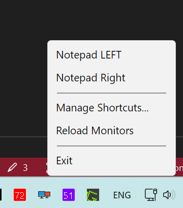
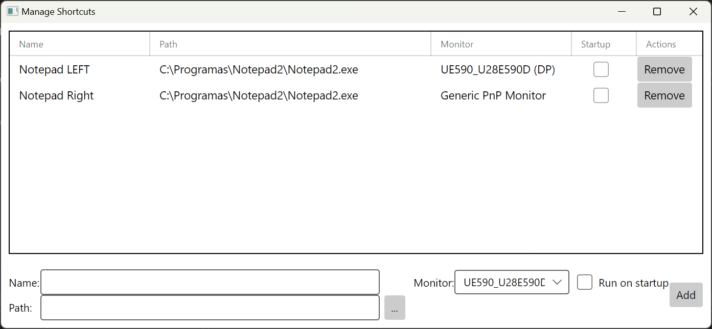

# SimpleMonitorTools

SimpleMonitorTools is a monitoring application that manages and launches shortcuts. It provides a user interface for managing shortcuts and a background service for monitoring.

## Problem and Solution

For users with multiple monitors, ensuring applications open on a specific display can be a repetitive and frustrating task of manually dragging windows. SimpleMonitorTools solves this by allowing you to pre-assign any executable to a desired monitor. With a single click from the system tray, your application will launch and automatically appear on the correct screen. You can create and manage different shortcuts with their own monitor settings, providing a streamlined workflow for your multi-monitor setup.

**Features:**
- Shortcut management
- Process launching
- Persistence using Windows Registry

**Technology:**
- C#
- Avalonia UI

## Screenshots

